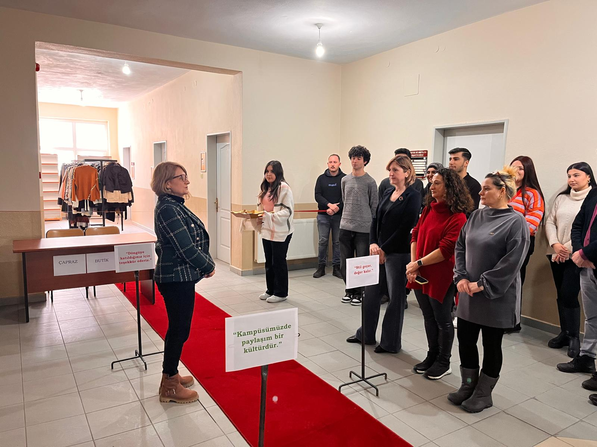

# Çapraz Butik



## Proje Hakkında

**Çapraz Butik**, Trakya Üniversitesi Keşan Yusuf Çapraz Uygulamalı Bilimler Yüksekokulu'nda hayata geçirilen sürdürülebilir bir moda ve ekolojik farkındalık hareketidir. Bu proje, *"Bugün bir yardım noktası değil, bir bilinç alanı açıyoruz"* vizyonuyla yola çıkarak tekstil atığını azaltmayı ve kampüs içinde dayanışmayı amaçlamaktadır.

Tamamen gönüllülük esasına dayanan bu butikte para geçmemektedir. Kullanılmayan ancak temiz ve giyilebilir durumdaki kıyafetler, ayakkabılar ve aksesuarlar butiğe getirilmekte ve dileyen herkes ücretsiz olarak bu ürünlerden faydalanabilmektedir. Bu web sitesi, butiğin amacını, işleyişini ve koleksiyonunu tanıtmak amacıyla hazırlanmış bir tanıtım sayfasıdır (Landing Page).

## Kullanılan Teknolojiler

- **HTML5:** Semantik ve erişilebilir web yapısı.
- **CSS3:** Modern, duyarlı (responsive) tasarım. Flexbox ve CSS Grid mimarileri kullanılmıştır.
- **Vanilla JavaScript:** Etkileşimli öğeler için hafif ve hızlı çözümler (bağımlılık olmadan).

## Öne Çıkan Özellikler

- **Zarif ve Modern Estetik:** Özel tipografi (Playfair Display ve Inter fontları) ve müze estetiğinden (Siyah, Beyaz, Gri tonlar) ilham alan premium tasarım.
- **Duyarlı (Responsive) Tasarım:** Mobil, tablet ve masaüstü cihazlarla tam uyumlu görünüm.
- **Mobil Menü (Hamburger):** Küçük ekranlar için optimize edilmiş, sezgisel açılır kapanır gezinme menüsü.
- **Yapışkan Başlık (Sticky Header):** Sayfa kaydırıldığında arka planı şeffaftan dolgu renge geçen, her zaman erişilebilir menü çubuğu.
- **Kaydırma Animasyonları (Scroll Reveal):** `IntersectionObserver` API kullanılarak performansı optimize edilmiş, sayfa kaydırıldıkça beliren zarif animasyonlar (Aşağıdan, sağdan ve soldan solma efektleri).

## Kurulum ve Kullanım

Bu proje statik bir web sayfasıdır. Çalıştırmak için herhangi bir paket yöneticisine veya sunucuya (build/compile) ihtiyaç yoktur.

1. Proje dosyalarını bilgisayarınıza indirin veya klonlayın (`git clone`).
2. Proje klasörünü açın.
3. `index.html` dosyasını herhangi bir modern web tarayıcısında (Google Chrome, Mozilla Firefox, Safari, Edge vb.) çift tıklayarak açın.

Dosya ve Klasör Yapısı

```text
/ (butik dizini)
│
├── assets/
│   └── images/          # Projede kullanılan tüm görseller (1.jpeg, 2.jpeg vb.)
│
├── index.html           # Ana ve tek sayfa (HTML yapısı)
├── style.css            # Tüm sitenin stil tanımlamaları
├── script.js            # Etkileşimler ve animasyonlar için JavaScript kodları
└── README.md            # Proje açıklaması (Bu dosya)
```

## Katkı Sağlama (Butik İçin Fiziki Katılım)

Çapraz Butik hareketine fiziki olarak destek vermek veya faydalanmak isterseniz:

- **Çalışma Saatleri:** Hafta içi her gün **09:00 - 17:00**
- **Konum:** Yüksekokul **Birinci Kat C Blok**
- **İşleyiş:** Ürün getirmek isteyenler eşyalarını **temiz bir şekilde** teslim edebilir, almak isteyenler ise diledikleri zaman butiği ziyaret edebilirler.

> *"Bugün alan, yarın veren; bugün faydalanan, yarın katkı sunan olabilirsiniz."*

## Lisans

Bu projenin içerik ve tasarım hakları **Çapraz Butik** girişimine aittir. 
&copy; 2026 Çapraz Butik - Tüm hakları saklıdır. Çevre için üretilmiştir.
